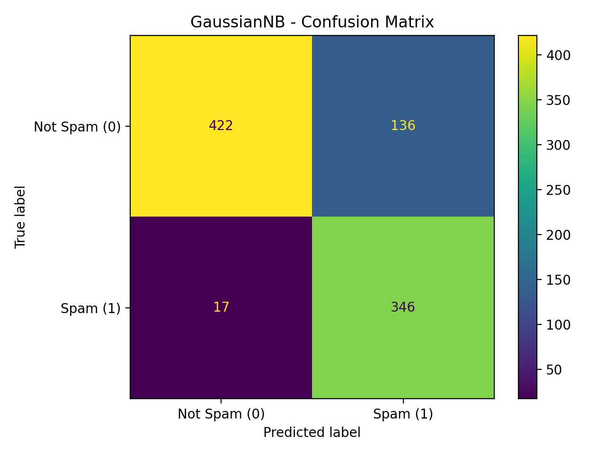
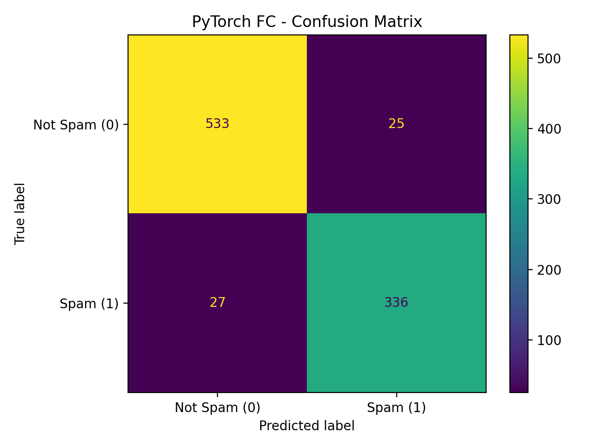
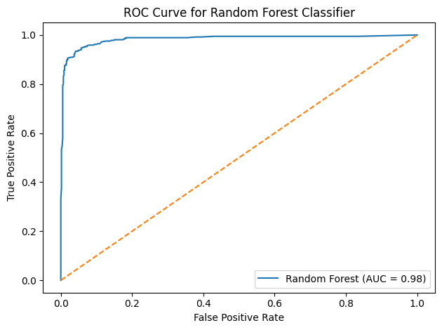

# Email Spam Classifier

## Overview
This project compares three machine learning models for email spam classification:
- Gaussian Naive Bayes
- Fully Connected Neural Network (PyTorch)
- Random Forest

## Dataset
UCI Spambase Dataset (4601 samples, 57 features)

## Models
- Naive Bayes
- PyTorch Neural Network
- Random Forest

## Evaluation
- Accuracy
- Precision
- Recall
- F1-score
- ROC Curve
- Confusion Matrix

## Results
### Confusion Matrices

**Gaussian Naive Bayes**


**PyTorch Fully Connected Neural Network**


**Random Forest**


### ROC Curve



## How to Run
```bash
pip install -r requirements.txt
python src/random_forest.py
